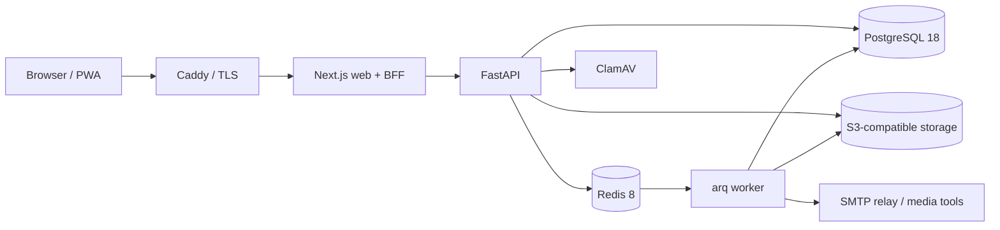

# TTLI LMS — Executive Training Platform

[](https://github.com/WillemKlopper87/TTLI_LMS/actions/workflows/ci.yml)

TTLI LMS is a multi-tenant platform for selling, administering and delivering
executive and leadership training. It combines a public website and catalogue,
customer and corporate onboarding, payments and invoicing, self-paced learning,
live workshops, certificates, reporting and tenant administration in one
codebase.

The implemented platform is ready for **guided end-to-end user acceptance
testing**. It is **not yet approved for a production launch**: recovery,
rollback, observability and POPIA lifecycle evidence remain on the hardening
gate, and several external integrations still require owner decisions and live
sandbox credentials. Phase 6 AI work has deliberately not started and remains
gated behind that work.

The authoritative current queue is [docs/BACKLOG.md](docs/BACKLOG.md). The
engineering handoff and known-gap inventory is
[docs/NEXT_AGENT_BRIEF.md](docs/NEXT_AGENT_BRIEF.md); the much larger
[docs/STATUS.md](docs/STATUS.md) and [docs/HANDOFF.md](docs/HANDOFF.md) are
historical records, not current status authorities.

## Product coverage

| Area | Current state |
|---|---|
| Public site and funnel | Implemented: tenant branding, public catalogue, course and workshop pages, resources, lead capture and checkout entry |
| Registration and identity | Implemented: guest checkout, magic links, invitations, password reset, TOTP MFA, break-glass administration and OIDC just-in-time provisioning. Tenant creation remains an operator action; there is intentionally no unrestricted public tenant-registration route |
| Commerce and payments | Implemented: catalogue, orders, South African VAT, EFT, purchase orders, invoices, ledger, approvals, refunds, subscriptions and Payfast adapter. Payfast still needs a real sandbox certification run; Netcash, international tax and multi-currency are not implemented |
| Core LMS | Implemented: course authoring, enrolment, learning paths, HLS video, signed playback, anti-bypass progress, captions, quizzes, surveys, assignments, certificates and transcripts |
| Corporate learning | Implemented: organisations, invitations, seat allocation, reporting and workshops. Microsoft Teams behaviour is covered by mocks but still needs validation in a live tenant |
| Administration | Implemented across tenant, content, commerce, learner, workshop and reporting workflows. Final policies, roles and operational acceptance need platform-owner sign-off |
| Gradebook | Backend foundation implemented in migration `0045`: weighted quiz/assignment achievement, assignment scores and learner read access. UI, rubrics, moderation, group reporting and export remain open |
| PWA and accessibility | Installable PWA behaviour and automated accessibility checks are in place. Formal launch conformance and human assistive-technology testing remain acceptance activities |
| AI insights | Not started. It is gated until T7–T13 establish production controls, data-residency policy, redaction, budgets and kill switches |

## Architecture



The browser talks to the Next.js backend-for-frontend rather than directly to
the API. PostgreSQL row-level security enforces tenant isolation; Redis backs
queues and short-lived state; S3-compatible storage holds source media,
transcodes and generated documents. The API and worker use the same application
image with different commands.

## Technology

| Layer | Choice |
|---|---|
| Web | Next.js 16 App Router, React 19, TypeScript 5.9 and Tailwind CSS 4 |
| API | Python 3.11+, FastAPI, SQLAlchemy 2 async, Alembic and Pydantic 2 |
| Contract | OpenAPI → `openapi-typescript` → `packages/api-client`, protected by a CI drift gate |
| Data | PostgreSQL 18 with tenant row-level security; Redis 8 with arq |
| Identity | Short-lived JWTs, Argon2id, magic links, TOTP and per-tenant OIDC/SAML foundations |
| Storage and media | S3/Azure/local storage adapters, Garage locally, ClamAV scanning and FFmpeg HLS transcoding |
| Email | Mailpit locally; a hardened Postfix relay hands production mail to the owner-selected SMTP provider |
| Analytics | First-party events in PostgreSQL; no third-party browser tracker is required |
| Deployment | Docker Compose for local and single-VM operation; a future managed Azure architecture is documented but not provisioned |

Technical decisions and rejected alternatives are recorded in
[docs/01_PRD.md](docs/01_PRD.md#5-technical-decisions).

## Repository layout

```text
apps/
  api/                         FastAPI application, Alembic migrations and tests
  web/                         Next.js public, learner and administration UI
packages/
  api-client/                  Generated TypeScript contract and client
infra/
  docker-compose.yml           Local dependencies
  docker-compose.prod.yml      Production-shaped local validation
  docker-compose.single-vm.yml Hardened single-VM runtime
scripts/
  dev-up.sh                    Local bootstrap helper
  gates.sh                     Local quality-gate sweep
  deploy-single-vm.sh          First deployment
  rolling-update.sh            Routine deploy and rollback workflow
  backup-production.sh         Database and object backup
  restore-drill.sh             Isolated RPO/RTO recovery proof
docs/                          Product, architecture, security and operations records
```

## Local development

### Prerequisites

- Docker Desktop or Docker Engine with Compose
- Python 3.11 or newer (CI uses Python 3.12)
- Node.js 24 and npm
- FFmpeg and ffprobe for media workflows
- Git Bash, WSL or another POSIX shell to use the repository helper scripts on Windows

### Start the dependencies

Copy `.env.example` to `apps/api/.env`:

```powershell
Copy-Item .env.example apps/api/.env
docker compose -f infra/docker-compose.yml up -d
```

On macOS/Linux, use `cp .env.example apps/api/.env`. ClamAV downloads its virus
database on first boot, which can take several minutes.

### Start the API and worker

From `apps/api`, create and activate a virtual environment, then run:

```bash
python -m pip install -r requirements-dev.txt
python -m alembic upgrade head
python -m uvicorn src.main:app --reload --port 8010
```

In a second activated terminal, also from `apps/api`:

```bash
python -m arq src.workers.main.WorkerSettings
```

The worker sends queued email, transcodes media and runs maintenance jobs.
Authentication emails remain queued if it is not running.

### Start the web application

```bash
cd packages/api-client
npm ci
cd ../../apps/web
npm ci
npm run dev
```

Open [http://localhost:3010](http://localhost:3010). For the second seeded
tenant, add `127.0.0.1 meridian.localhost` to the hosts file and open
[http://meridian.localhost:3010](http://meridian.localhost:3010). Local
break-glass credentials are configured in `apps/api/.env`.

From Git Bash or WSL, `scripts/dev-up.sh` starts the dependency stack and prints
the application commands.

## Local ports

| Service | Port |
|---|---:|
| Web | 3010 |
| API | 8010 |
| PostgreSQL | 5452 |
| Redis | 6399 |
| Garage S3 API | 9140 |
| Garage admin API | 9141 |
| Mailpit SMTP | 1145 |
| Mailpit web UI | 8145 |
| ClamAV | 3410 |

The non-default ports avoid collisions with other local projects.

## Quality and CI

Run the complete local gate sweep from a POSIX shell:

```bash
scripts/gates.sh
```

Useful focused checks include:

```bash
cd apps/api
python -m pytest
python -m ruff check src tests
python -m mypy src

cd ../../apps/web
npm run typecheck
npm run lint
npm test
npm run build

cd ../..
python docs/check_links.py
```

The GitHub Actions pipeline runs API tests and coverage, linting, strict type
checking, Alembic upgrade/downgrade checks, OpenAPI client drift detection, web
unit/build checks, Playwright journeys with axe accessibility checks,
authenticated end-to-end tests, secret scanning and backup preflight checks.
It also scans application and infrastructure images for high/critical
vulnerabilities, emits SPDX SBOMs and signs pushed application images and SBOM
attestations with Cosign.

Infrastructure images are digest-pinned. PostgreSQL findings are not silently
ignored: each temporary exception is scoped to the affected image and carries a
dated disposition in `.trivyignore`; CI also verifies that those entries cannot
mask the same CVE in other images.

## Deployment and production readiness

`infra/docker-compose.prod.yml` is useful for a production-shaped local build.
It is not the production release procedure. The currently implemented launch
path is the hardened single-VM topology in
[docs/research/single-vm-deployment.md](docs/research/single-vm-deployment.md),
using `scripts/deploy-single-vm.sh` for first installation and
`scripts/rolling-update.sh` for routine releases and rollback.

Application images are built only after quality gates pass, scanned, pushed,
signed and consumed by digest. Caddy is the only public container in the
single-VM topology. PostgreSQL, Redis, object storage, ClamAV and the SMTP relay
remain private; the Garage backup endpoint binds only to loopback.

The active production gate is:

| Gate | State | What remains |
|---|---|---|
| T7 — CI transaction race | Done | Keep the remote push pipeline green |
| T8 — PostgreSQL image vulnerabilities | Done | Continue expiry-driven review of the documented, image-scoped dispositions |
| T9 — Backup and restore rehearsal | In progress | Configure a real encrypted off-VM remote and named owner, then run and sign the production recovery report |
| T10 — Deployment integrity | Open | Prove active canary validation and whole-application rollback |
| T11 — Observability | Open | Add metrics, central log shipping, actionable alerts and an operator dashboard |
| T12 — POPIA lifecycle | Open | Implement and test export, correction, erasure, retention, withdrawal and legal-hold operations |
| T13 — Phase 6 entry decision | Blocked by T9–T12 | Approve data residency and add tenant AI kill switches, rollout controls and budget enforcement |

Staging infrastructure, live payment and Teams certifications, production load
testing, penetration testing and formal launch acceptance are still required.
The Azure managed-services blueprint remains an option for later scale; no Azure
environment is currently provisioned by this repository.

## Decisions required from the platform owner

Engineering can complete the launch once business owners supply the remaining
tax, accounting, legal/privacy, content, branding, marketing, identity, payment
gateway and operational decisions and evidence. Two matched documents make that
review concrete:

- [Platform Owner Decision Pack](docs/PLATFORM_OWNER_DECISION_PACK.md) — 87 numbered questions, owners, launch impact and required evidence.
- [Recommended Defaults](docs/PLATFORM_OWNER_RECOMMENDED_DEFAULTS.md) — a standards-aligned proposed answer for every question that owners can accept or replace, subject to professional legal, tax and accounting review.

The highest-impact unresolved choices include international digital-services
tax treatment, launch countries and currencies, payment-provider credentials,
refund and invoicing policy, approved content and brand assets, privacy and
retention rules, support ownership, recovery ownership, video-protection
acceptance and whether redacted AI prompt data may leave South Africa.

## Documentation map

| Document | Purpose |
|---|---|
| [Product requirements](docs/01_PRD.md) | Personas, requirements, workflows, decisions, NFRs and delivery plan |
| [Data model](docs/02_DATA_MODEL.md) | PostgreSQL schema, tenancy, protection and retention conventions |
| [API specification](docs/03_API_SPEC.md) | REST conventions, endpoint contracts and test expectations |
| [Security and compliance](docs/04_SECURITY_AND_COMPLIANCE.md) | Authentication, authorisation, POPIA, encryption, audit and AI controls |
| [Commercial model](docs/05_COMMERCIAL.md) | Packaging and feature matrix; prices are not quotable until the cost model and owner decisions are complete |
| [Operations](docs/06_OPERATIONS.md) | Runtime topology, storage, media, monitoring, backups, recovery and runbooks |
| [Current backlog](docs/BACKLOG.md) | Authoritative ordered work queue |
| [Engineering handoff](docs/NEXT_AGENT_BRIEF.md) | Engineering context and known-gap inventory |
| [Remediation ledger](docs/REMEDIATION_LEDGER.md) | Security and quality finding disposition |
| [Owner decision pack](docs/PLATFORM_OWNER_DECISION_PACK.md) | Launch questions and required evidence |
| [Owner recommended defaults](docs/PLATFORM_OWNER_RECOMMENDED_DEFAULTS.md) | Proposed market- and standards-aligned answers |
| [Changelog](CHANGELOG.md) | Shipped changes by version |

The original generated planning material under `docs/source/` is preserved for
traceability but is not authoritative. Where it conflicts with the current
product decisions, [docs/01_PRD.md §5](docs/01_PRD.md#5-technical-decisions)
wins.
