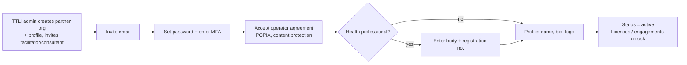
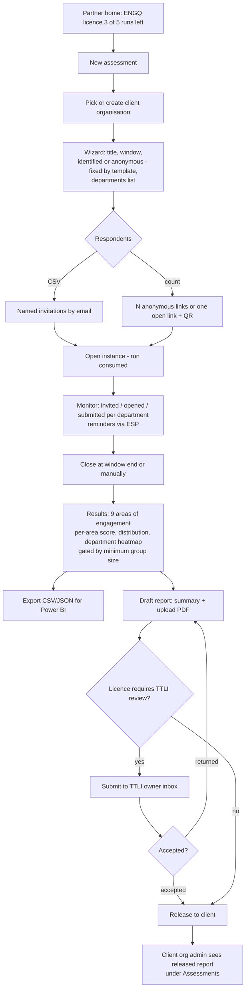
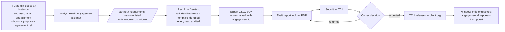
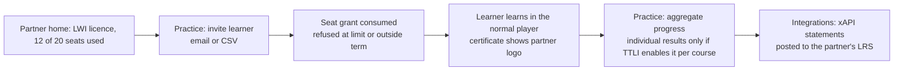
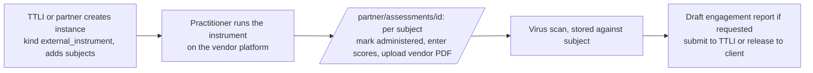

# Partner portal — design and flows

**Date:** 2026-09-11 · **Status:** draft for review · **Source:** customer request after the 2026-09-11 session
**Sits on top of:** [assessment platform](2026-09-11-assessment-platform-design.md), [analyst workspace](2026-09-11-analyst-workspace-design.md), [facilitator licensing + xAPI](2026-09-11-facilitator-licensing-xapi-design.md). This document adds the *view* and three small model deltas; it does not replace those specs.

## 1. Why a separate view

`/admin` is TTLI's operations console: CRM, payments, catalogue, audit, settings. External consultants, licensed facilitators and health professionals must never see it, and hiding sidebar items is not isolation. They get their own shell at `/partner`, driven by **organisation membership and engagements**, not by admin permissions. An external user with no admin permission who hits `/admin` is redirected to `/partner`; a partner with no active licence or engagement sees an empty, explanatory home rather than an error.

This matches how the reference platforms work. Gallup Access gives coaches and leaders a portal of unit-level reports, credential management and action planning, separate from Gallup's own administration ([Gallup Help Center](https://support.gallup.com/hc/en-us/articles/48590032985491-Accessing-and-Viewing-Reports), [Gallup Access](https://www.gallup.com/access/home.aspx)). Thomas Assess and TTI's D.E.A.P. sell practitioners credits, let them invite respondents by code or link, and return narrative reports per respondent or unit ([Thomas.co](https://www.thomas.co/assessments/psychometric-assessment-aptitude-tests), [TTI Success Insights](https://ttisuccessinsights.ie/products/)). The common shape: **credits → invites → results → reports → my credentials**.

## 2. Partner types

One portal, one `partner_profiles` row per organisation, three capability sets switched by what TTLI has granted. A single person can hold more than one.

| Type | Who | Granted by | Portal modules |
|---|---|---|---|
| **Analyst** (contracted consultant, psychologist) | Works on *TTLI's* clients' assessments | An engagement (analyst spec §3) | Engagements, Reports (submit to TTLI) |
| **Licensee facilitator** | Runs LWI for *their own* learners | A course licence (licensing spec §3) | Practice: learners, seats, cohorts, progress; Integrations (xAPI) |
| **Licensed practitioner** (consultant or health professional) | Runs the TTLI ENGQ for *their own* client companies | An assessment licence (new, §4.2) | Clients, Assessments (run ENGQ), Results, Reports (release to client, optionally via TTLI review) |

A fourth capability, **Accredited administrator**, covers DISC and REACH:
the practitioner holds the vendor accreditation, administers the instrument
on the vendor's platform, and uses the portal only to record who was
assessed and upload the per-subject report (assessment spec §1a, kind
`external_instrument`). Their accreditation (vendor, certificate reference,
expiry) is stored on the partner profile and shown on the report cover.

Health professionals are licensed practitioners with two extra profile fields: professional body and registration number (for example HPCSA), shown on the report cover and required before an assessment licence can be activated. No patient data enters the platform; respondents are employees of a client company, exactly as for any ENGQ run.

## 3. Portal structure

```
/partner                      Home: active licences, credits, open engagements, inbox
/partner/onboarding           First login: MFA, operator agreement, profile, registration
/partner/clients              Licensed practitioner: client organisations (create, list)
/partner/clients/[id]         Client detail: assessments run, released reports
/partner/assessments          Run ENGQ: new instance wizard, monitor, close
/partner/assessments/[id]     Invitations, completion, results, export, draft report
/partner/engagements          Analyst: TTLI-assigned instances, window, status
/partner/engagements/[id]     Same detail page as above, in engagement mode
/partner/reports              Drafts, submitted, returned, accepted, released
/partner/practice             Licensee: learners, seats, invite, cohorts, progress
/partner/integrations         xAPI LRS settings and status
/partner/profile              Credentials, agreements, registration, logo, MFA
```

Detail pages are shared components with a mode flag; the analyst mode hides invitations and client management, since TTLI ran the instance.

## 4. Model deltas (on top of the three specs)

### 4.1 Client organisations under a partner

```
organisations
  + parent_organisation_id (nullable, FK organisations.id)
  + kind gains 'partner' and 'client'
```

A licensed practitioner's clients are `client` organisations whose parent is the partner. The partner's org admins are treated as admins of every child for assessment purposes only, never for seats, billing or CRM. TTLI sees the whole tree. `licensee` from the licensing spec is folded into `partner`; the LWI licence, not the org kind, is what enables the Practice module.

### 4.2 Assessment licences

```
assessment_licences
  id, tenant_id, organisation_id (partner), template_id,
  status, runs_purchased int, runs_used int, starts_at, ends_at,
  requires_ttli_review bool (default true), price_per_run_cents, currency,
  order_id (nullable), timestamps
```

One run = one instance for one client organisation, regardless of respondent count (matches how TTLI sells an engagement analysis today; per-respondent pricing can be added as a second unit later). `requires_ttli_review` is the quality gate: when true, the practitioner's report must go through the TTLI owner inbox before it can be released to the client. TTLI can relax it per partner once trusted.

### 4.3 Partner profile and agreements

```
partner_profiles
  organisation_id UNIQUE, display_name, bio, logo_object_key,
  professional_body (nullable), registration_number_encrypted (nullable),
  operator_agreement_ref, operator_agreement_accepted_at, accepted_by_user_id,
  status ('invited'|'onboarding'|'active'|'suspended'), timestamps
```

No licence or engagement becomes usable until `status = active`, which requires MFA enrolled, the operator agreement accepted, and, for health professionals, a registration number.

## 5. Flows

### 5.1 Partner onboarding



Audit events on invite, agreement acceptance and activation. Suspension by TTLI revokes portal access immediately and freezes, not deletes, client data.

### 5.2 Licensed practitioner runs a TTLI ENGQ



The instance belongs to the client organisation; the partner reaches it through the parent link. TTLI sees every instance and report in `/admin` under the partner, plus the usage report from the licensing spec extended with assessment runs.

### 5.3 Contracted analyst works a TTLI engagement



The analyst never sees the client organisation's members or other instances, and never releases anything; TTLI does.

### 5.4 Licensee facilitator runs LWI



### 5.5 Accredited administrator records a DISC or REACH result



### 5.6 360 assessment (LWIA / CWIA)

The practitioner flow in §5.2 applies with a subjects step: add leaders,
add raters per leader (or let leaders self-nominate with manager
confirmation), open, monitor per subject and rater group, close, then
per-subject reports plus an organisation roll-up. Peer and direct-report
groups stay hidden below three responses.

## 6. The TTLI ENGQ template

Modelled as an `assessment_template` with nine sections matching the nine areas of the TTLI Engagement Model ([ttli.co.za/engagement](https://ttli.co.za/engagement/)), Likert 1–5 with optional reverse-scored items, one free-text item per area, and department and role attributes on the respondent. Results page shows area scores, the weakest three areas, and department heatmap above threshold. The specific areas and item wording are the customer's IP and must come from them (§9). Anonymous by default: TTLI's own article argues most employees will not answer internal surveys honestly, so trust in anonymity is the product ([ttli.co.za](https://ttli.co.za/why-south-african-companies-get-employee-engagement-wrong/)).

## 7. Security and isolation

- Portal routes require an active `partner_profiles` row for one of the user's organisations; admin permissions are never consulted, and admin routes reject partners.
- Data scope for a partner is the union of: their own organisation, its `client` children, and active engagements. Nothing else resolves, whatever the URL.
- Every results, free-text and export read is audited with row counts (analyst spec §3); practitioner reads of their own clients' data are audited the same way.
- Content protection for LWI licensees is unchanged from the licensing spec §5.
- Suspension is immediate, cache-free, and freezes client data for TTLI review.
- Operator agreement and professional registration are recorded, not just ticked: agreement reference and acceptance timestamp on the profile, registration number encrypted at rest.

## 8. What changes in `/admin`

One new section, **Partners**: list of partner organisations with type badges, status, licences, runs and seats used, open engagements, pending reports. From it: invite partner, grant licence, assign engagement, suspend. The owner inbox for reports (analyst spec §4) lives here too. Existing Organisations screens gain a "Parent" column for client orgs.

## 9. Open items for the customer

- Item content for all six TTLI-owned instruments (see assessment spec §10). Without it every template is a shell.
- Which practitioner holds DISC and REACH accreditation, and on which vendor platform they administer.
- Whether a practitioner's first N runs must always pass TTLI review, and whether reports released without review still carry TTLI branding.
- Pricing unit for ENGQ licences: per run (assumed), per respondent, or annual unlimited.
- Whether health professionals are ever licensed for LWI as well as ENGQ (the model allows it; the commercial answer decides the pricing page).

## 10. Size

M on top of the three specs: the portal shell and shared detail components (about two weeks), the three model deltas and the Partners admin section (about one week). Sequence it directly after the assessment platform so the practitioner flow can be demoed with the ENGQ shell before the analyst and licensing work completes.
